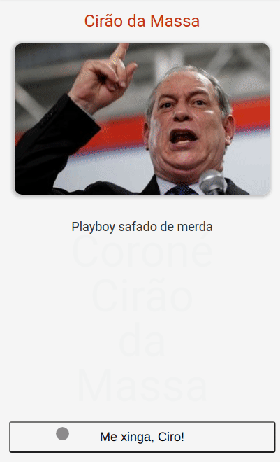

<h1>Cirão da Massa</h1>



Que tal, saber como é a sensação de conversar um pouco com o Ciro Gomes?

https://alvescleiton.github.io/cirao-da-massa

--- 

## Tools
* React

## Clone and Run
```bash
# clone the project
git clone https://github.com/alvescleiton/cirao-da-massa.git
```

```bash
# install dependencies
npm install
```

```bash
# run the project
npm run start
```

## Contribute
Contribute to the project by adding new features or fixes!

## License
<a href="https://opensource.org/licenses/MIT"></a>